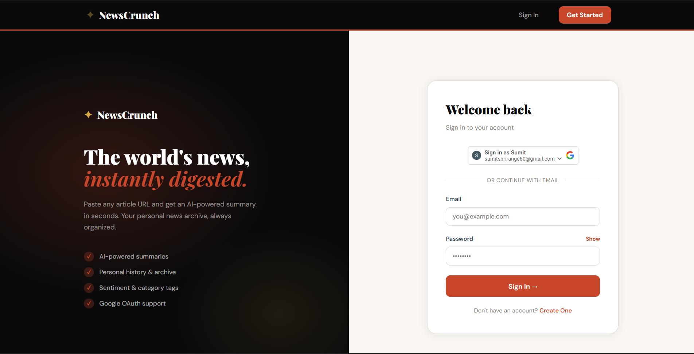
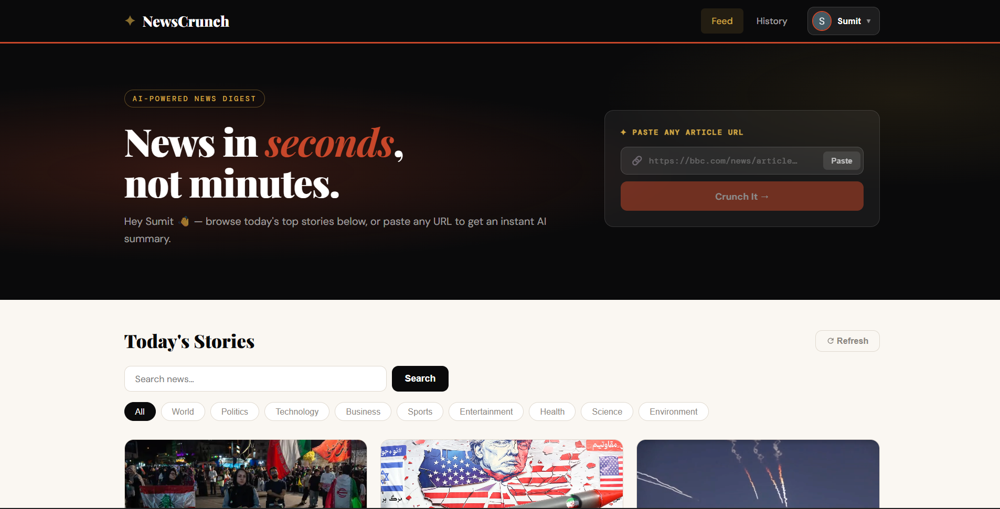
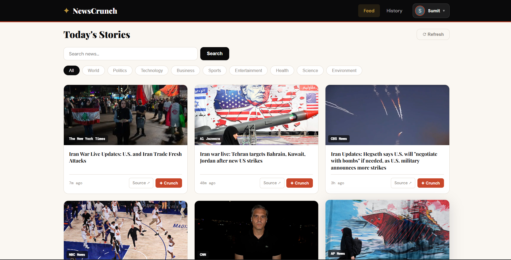
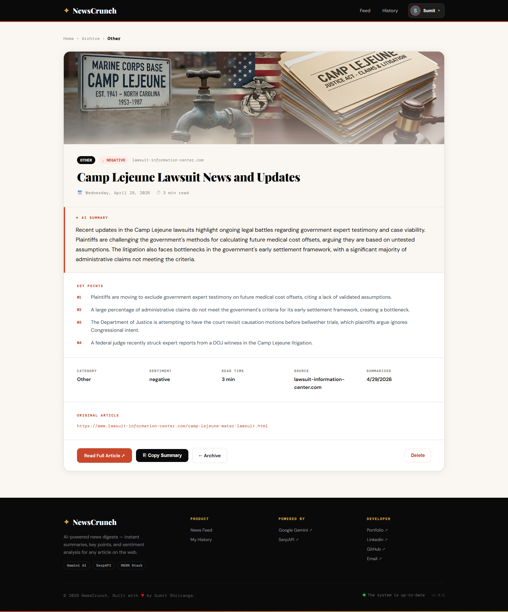

<h1 align="center">📰 NewsCrunch (AI-Powered News Summarizer)</h1>

<div align="center">

### News in seconds, not minutes.

AI-powered news aggregation and article summarization platform built with the MERN Stack. Instantly generate concise summaries, sentiment analysis, and key insights from any news article URL.

🌐 **Live Demo:** https://newscrunch.vercel.app/

</div>

---

## ✨ Features

### 🤖 AI-Powered Summarization

- Generate instant AI summaries from any news article URL.
- Extract essential information in seconds.
- Save time by avoiding lengthy articles.

### 📰 Real-Time News Feed

- Browse trending news from multiple trusted sources.
- Stay updated with current events worldwide.
- Auto-refresh latest headlines.

### 🔍 Search News

- Search news articles by keywords.
- Quickly discover stories matching your interests.

### 🏷️ Category-Based Filtering

Browse articles across multiple categories:

- 🌍 World
- 🏛 Politics
- 💻 Technology
- 💼 Business
- ⚽ Sports
- 🎬 Entertainment
- 🏥 Health
- 🔬 Science
- 🌱 Environment

### 📊 Sentiment Analysis

Each article is analyzed and tagged as:

- Positive
- Neutral
- Negative

### 📌 Key Points Extraction

- Automatically extracts important takeaways.
- Displays concise bullet-point insights.

### 🔗 Original Source Access

- Read the complete article from the original publisher.
- Direct source links included.

### 📚 Personal News Archive

- Save generated summaries.
- Access previous summaries anytime.
- Maintain a personalized reading history.

### 🔐 Authentication

- Email & Password Login
- Google OAuth Authentication
- Secure JWT-based Authorization

### 👤 Personalized Dashboard

- User-specific history
- Protected routes
- Personalized experience

### ⚡ Modern UI/UX

- Fully Responsive Design
- Mobile Friendly
- Fast Loading Experience
- Smooth User Interactions

---

## 🛠️ Tech Stack

| Layer     | Tech                                        |
| --------- | ------------------------------------------- |
| Frontend  | React.js, Tailwind CSS, Framer Motion       |
| Backend   | Node.js, Express.js                         |
| Database  | MongoDB + Mongoose                          |
| Auth      | JWT (access 15m + refresh 7d), Google OAuth |
| AI & APIs | Google Gemini API, SerpAPI Google News      |
| Deploy    | Vercel                                      |

---

## 📸 Screenshots

### Login Page



### Home Page



### News Feed



### AI Summary


### Article Details



---

## 🚀 Getting Started

### 1. Clone Repository

```bash
git clone https://github.com/sumitshrirange/NewsCrunch.git
```

### 2. Install Dependencies

```bash
cd NewsCrunch
npm install
```

---

## 🔑 Environment Variables

Create a `.env` file in the directory:

| Variable                | Description                   |
| ----------------------- | ----------------------------- |
| `VITE_API_URL`          | API base URL (default `/api`) |
| `VITE_GOOGLE_CLIENT_ID` | Google OAuth Client ID        |

---

## ▶️ Run Locally

### Start Frontend

```bash
npm run dev
```

Visit:

```bash
http://localhost:5173
```

---

## 🎯 Use Cases

- Stay informed without reading lengthy articles.
- Track sentiment across current events.
- Build a personal archive of summarized news.
- Research trending topics quickly.
- Save time consuming daily news.

---

## 👨‍💻 Author

**Sumit Shrirange**

- Portfolio: https://sumitshrirange.in
- GitHub: https://github.com/sumitshrirange
- LinkedIn: https://www.linkedin.com/in/sumitshrirange
